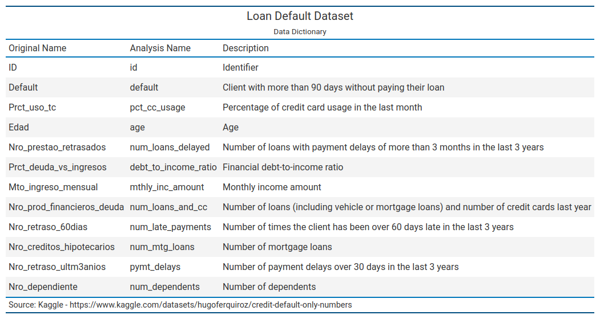
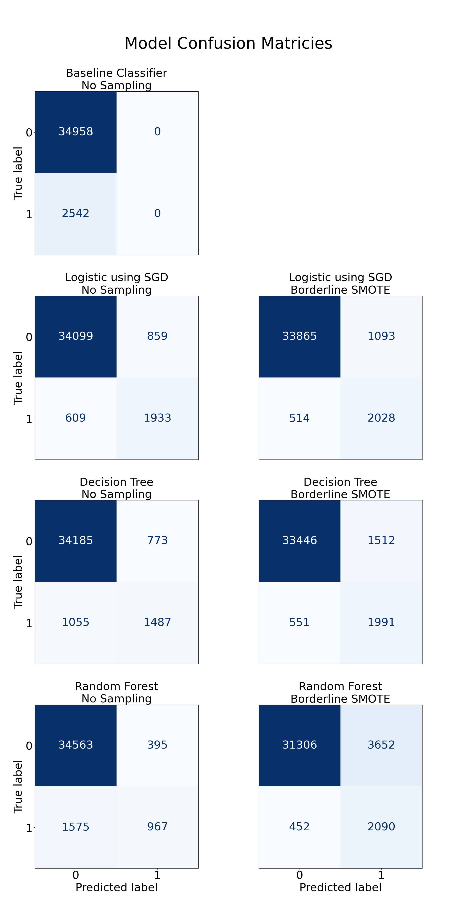

# Capstone Project - Credit Default Final Report

## Problem Statement

A key question for many financial institutions is whether an individual or entity 
will default on a loan. This important question can have wide implications, not 
just for a single institution, but also for economies as a whole.

This project will look at predicting the probability of default using machine 
learning methods.

## Model Outcomes or Predictions

This is a supervised learning model, binary classication to be more precise. The
output of this project will be several models that yield a prediction of default 
(1 = Default, 0 = No default). Scoring techniques will be used to choose the best
model for our purposes.

## Data Aquisition

This analysis is based on a dataset from [Kaggle](www.kaggle.com). It is titled
'credit default only numeric data', and is provided by Hugo Fernandez Quiroz. The
columns of the raw dataset are detailed below. Note that columns have been renamed
as original column names were in Portugues.

These columns represent a number of financial indicators that could be drivers
of default rates. Note that the default rate of the overall data is approximately
6.7%. Consequently, this represents and unbalanced classificaton.

Note that the data has been anonymized by the original author, so any Personal 
Identifiable Information has been eliminated.

  

## Data Preprocessing/Preparation

There were a number of data preproccessing steps that were undertaken.

1) **Treat Missing Values** - Two columns, mthly_inc_amount, and num_dependents had
   20.3% and 2.5% missing values respectively. In order to perserve these columns
   in the modeling, K-Nearest Neighbors was used to impute values
2) **Duplicate Values** - After exploratory analysis, no duplicate values were found.
3) **Outliers** - Outliers were found to be a problem across many variables. We used
   the Isolation Forest Algorith (based on Random Forest) to flag and eliminate
   outliers.
4) **Training/Test Splits** - The training/split was executed using the scikit
   defaults, which are 75% and 25% for train and test sets respectively.
5) **Sampling** - The classification problem was found to be imbalanced. Consequently,
   we used the SMOTE algorithm, round in the imblearn module, to create balanced
   versions of the training datasets.
6) **Feature Engineering** - For the Stochastic Gradienct Descent Logistic Regression 
   model, polynomial features were generated. 
6) **Encoding** - For certain models (ie. Logistic Regression) a standard scaling was
   used on all features. This aided in the convergence of the algorithm. 

## Modeling

Four different models were evaluated for this project. Details are given below.

1) **Dummy Classifer** - This was a model that always predicted the majority class
   (no default). This model is the baseline against which other models are judged.
   This model had no sampling or feature engineering.
2) **Logistic Regression using Stochastic Gradeint Descent** - This model required
   a balanced dataset. Polyno ial features were generated. All features were then
   standardized for better convergence. As the resampled/balance dataset had many
   samples, in the 100,000's, stochastic gradient desecent was used for computational
   efficiency.
3) **Decision Tree** - A decision tree was generated. The final decision tree
   was the result of a grid search over the following hyper parameters:

   - Minimum Impurity Decrease (range from .001 to .05)
   - Max Tree Depth (2, 5, or 10)
   - Minimum Samples Split (0.1, 0.2, 0.5)
   - Criterian (gini or entropy)

   The decision tree was generate against the balanced data set.
4) **Random Forest** - A random forest model was generated. The algorith was
   passed the optimized parameters from the single descision tree model previously
   run. This model was also run against the balanced datasets.

## Model Evalution

Modeling results from the four different models investigated were remarkably similar
with only small differences in the confusion matricies. See the results in the below
graphic.

The following table takes a look at some of the key performance metrics across
the different model.

  

## Results & Findings

## Areas for Further Exploration

